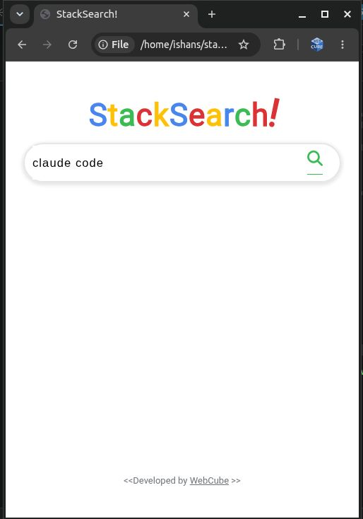
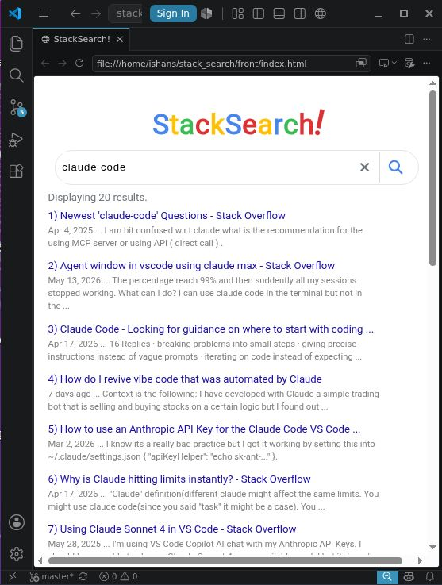
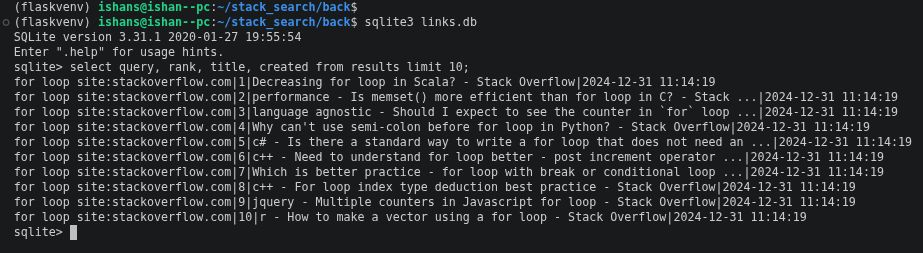
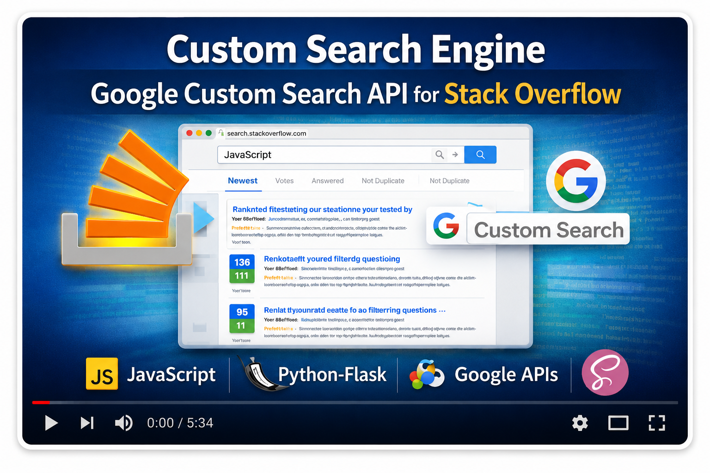

# Custom Search Engine for StackOverflow

> A full-stack search tool that queries StackOverflow via the Google Custom Search API, ranks and filters results by relevance, and displays them through a clean UI.

---

## What problem does it solve?

StackOverflow's built-in search is notoriously weak — it misses relevant answers, buries high-quality posts, and doesn't let you sort or filter results meaningfully before you click through.

This project wraps Google's search index (which covers StackOverflow thoroughly) with a custom relevance layer, so you get:

- Google-quality search results scoped entirely to StackOverflow
- Backend filtering and ranking by relevance before results reach the UI
- A focused interface with no ads, recommended posts, or sidebar noise

---

## Technologies used

| Layer | Technology |
|---|---|
| Frontend | HTML · CSS · Vanilla JavaScript |
| Backend | Python |
| Search | Google Custom Search API |
| Data source | StackOverflow.com |
| Dev server | VSCode Live Server |
| Storage | SQLite (local backend store) |

---

## How does it work?

1. The user types a query into the frontend search input
2. The frontend sends the query to the Python backend
3. The backend calls the **Google Custom Search API**, scoped to `stackoverflow.com`
4. Results are **ranked and filtered by relevance** and stored in the backend database
5. The filtered results are returned to the frontend and rendered as a result list

The backend storage step means repeated searches are fast (cached results) and you can inspect or reprocess stored results without hitting the API again.

---

## Screenshots

### Search input UI

### Results list with ranked StackOverflow links

### Backend database showing stored results


---

## Demo video

<a href="https://youtu.be/yTEkX-dUy6o">
  
</a>

---

## Getting started

### Prerequisites
- Python 3.x
- A Google account (for Custom Search API)

### 1. Get your API key

**Google Custom Search key:**
1. Go to [programmablesearchengine.google.com](https://programmablesearchengine.google.com/)
2. Create a new search engine scoped to `stackoverflow.com`
3. Copy your Search Engine ID and API key

### 2. Configure the backend

- Add your keys to the backend config (environment variables or a config file — keep them out of source control).
- Create virtual env:
  ```bash
    python3.10 -m venv flaskvenv
    source flaskvenv/bin/activate
    pip install flask pandas requests beautifulsoup4
  ```

### 3. Run the backend

- Run Flask server: 
  ```bash
  source flaskvenv/bin/activate
  cd back/
  flask --debug run --port 5001
  ```
- Run SQL queries:
  ```bash 
  sqlite3 links.db
  select query, rank, title, created from results limit 10;
  ```


### 4. Open the frontend

Open `index.html` via VSCode. To prevent unnecessary page reloads when backend files change, add this to your VSCode settings:

```json
{
  "liveServer.settings.ignoreFiles": [
    "**/*.py",
    "**/*.db",
    "**/back/**",
    "**/.git/**"
  ]
}
```

---

## Learning references

Built from scratch using:
- Frontend — [Wikipedia Search App by Dave Gray](https://github.com/webQbe/js_search_app)
- Backend — [Python Google Search Filter by Dataquest](https://github.com/webQbe/google_search_filter)

---

## License

MIT